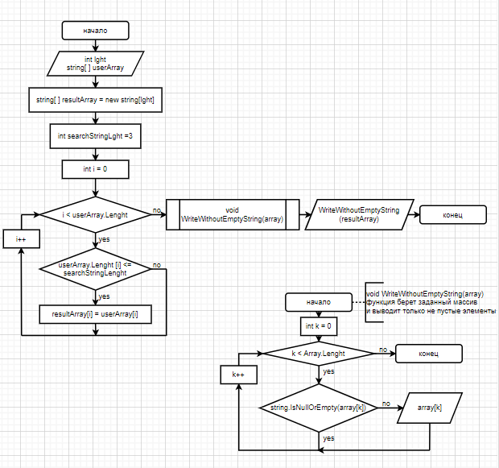

# **Итоговая проверочная работа**

## **Задание**

    Написать программу, которая из имеющегося массива строк формирует массив из строк, длина которых меньше либо равна 3 символа. Первоначальный массив можно ввести с клавиатуры, либо задать на старте выполнения алгоритма. При решении не рекомендуется использоваться коллекциями, лучше обойтись исключительно массивами. 

## **Блок-схема алгоритма**

### *Алгоритм:*
1. Пользователь вводит длину массива.
2. Согласно заданной длине пользователь вводит все элементы массива.
3. Создается второй массив с таким же размером.
4. Делаем перебор элементов заданного массива.
5. Проверяем каждый элемент на соответствие заданному условию: меньше либо равна 3 символа.
6. Если условие выполняется, то значение вводится во второй массив, созданный в п.2.
7. Повторяем пп. 5 и 6 пока не достигнем конца заданного массива.
8. Выводим на экран с помощью отдельной функции, которая:
* делает перебор полученного массива;
* проверяем каждый элемент на соответствие условию: сожержатся ли в нем символы;
* если условие выполняется, то элемент выводится;
* повторяем последние два пункта пока не достигнем конца полученного массива.
